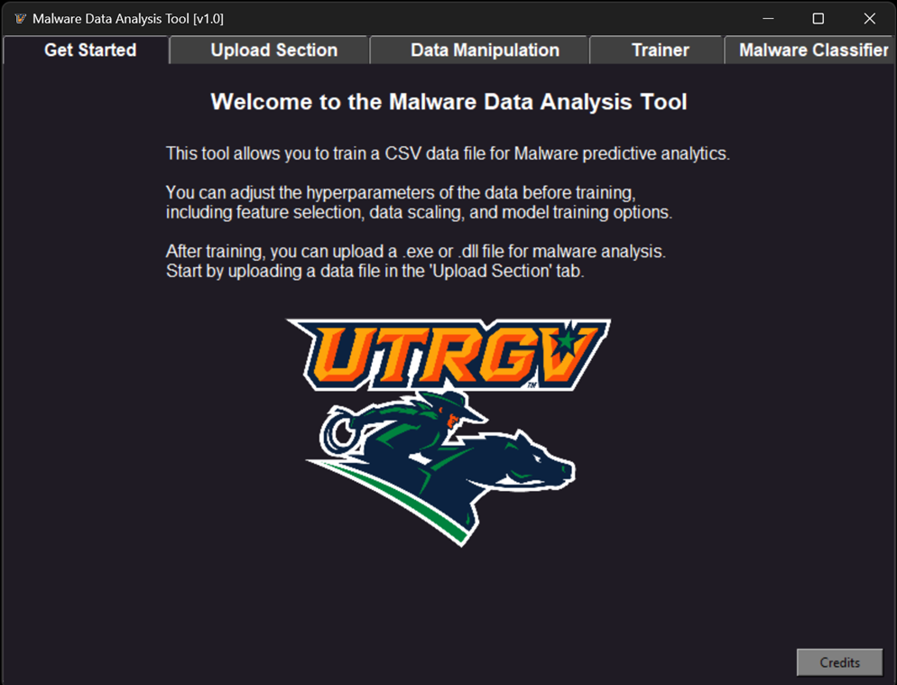

# Jorge Rodriguez Project Portfolio

## [Project 1: PEAnalyzer - Malware Classification with Python & Tkinter](URL)

This is a final project I did for my CYBI 4336 - Cyber Security Eng w/ AI & ML course  For The University of Texas Rio Grande Valley. 

### Overview

PEAnalyzer is a user-friendly malware analysis tool designed to empower security professionals and researchers.  Built with Python and a Tkinter GUI, it facilitates the extraction of features from Portable Executable (PE) files, the training of machine learning models, and the classification of unknown files as malware or benign.

### Key Features

### Data Handling:
* Load and process malware datasets from CSV files.
* Data preparation with feature selection and scaling (StandardScaler, RobustScaler).
* PE Feature Extraction: Calculate informative file statistics such as entropy, section sizes, and more using the pefile library.
  
### Machine Learning Integration:
* Train Support Vector Machine (SVM) classifiers with customizable parameters or utilize grid search optimization.
* Employ Random Forest for robust malware detection.
  
### Intuitive GUI:
* Conveniently upload and analyze PE files.
* Visualize results with a Seaborn confusion matrix.
* User-friendly interface with dark mode and hover effects.
* Error Handling & Utility: Robust exception handling and helper functions for a smooth user experience.
  
### Target Audience

Cybersecurity analysts seeking to improve malware detection.
Researchers exploring malware characteristics and classification techniques.
Students learning about practical malware analysis and machine learning.

### Benefits
Streamlines the malware analysis workflow.
Provides insights into PE file characteristics.
Offers a flexible platform with customizable machine learning models.

### Pictures

